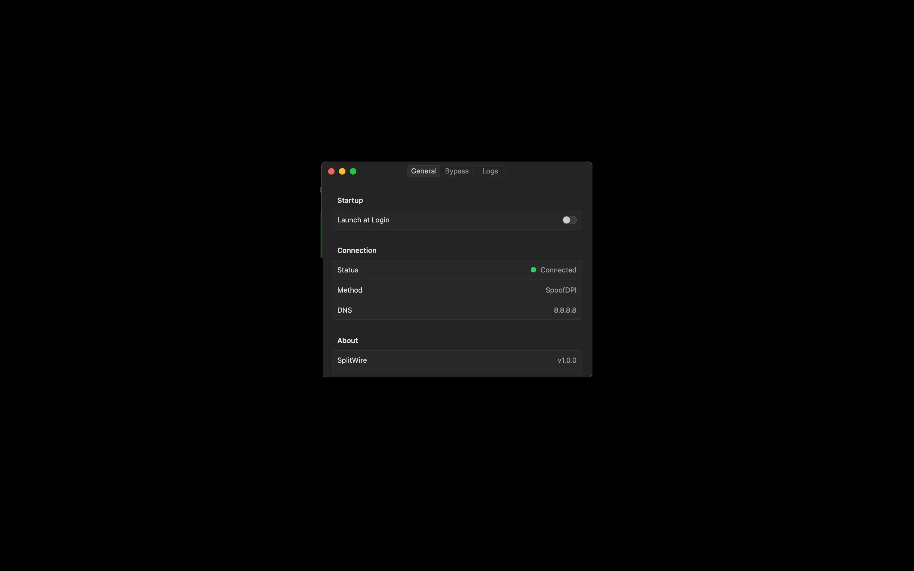

# PunchThrough for macOS

A native macOS menu bar application that bypasses DPI (Deep Packet Inspection) restrictions. Works with ISPs that use DPI-based internet filtering.

## Screenshots

| Disconnected | Connected | Settings |
|:---:|:---:|:---:|
|  |  |  |

## Features

- **One-click connection** - Connect/Disconnect from the menu bar
- **Two bundled bypass engines** — choose in Settings → Bypass:
  - **SpoofDPI** (default) — userspace HTTP proxy. Zero setup, no admin needed.
  - **Zapret (tpws)** — transparent TCP proxy. One-time admin install. Keeps app
    updaters working (e.g. Discord desktop in-app updates).
- **Automatic proxy setup** — system HTTP/HTTPS proxy configured for you (SpoofDPI engine)
- **DNS over HTTPS** — Secure encrypted DNS queries
- **Multiple DNS options** — Google, Cloudflare, Quad9, or custom DNS
- **Multi-language** — English, Turkish, French (selectable in Settings)
- **Auto-connect on launch** + **Launch at login**

## Requirements

- macOS 14.0 (Sonoma) or later

Both bypass engines (SpoofDPI and tpws) are bundled with the app — no separate installation needed.

## Installation

#### Pre-built (recommended):
Download `PunchThrough.app` from [Releases](https://github.com/quardianwolf/PunchThrough-MacOS/releases) and move it to `/Applications`.

**Getting "Not compatible" or "damaged" error?**

This happens because macOS blocks apps that are not signed/notarized by Apple. It works on both Intel and Apple Silicon. To fix:

1. Download the latest release and move PunchThrough.app to your Applications folder
2. Open Terminal (Applications > Utilities > Terminal)
3. Run: `xattr -cr /Applications/PunchThrough.app`
4. Open PunchThrough.app normally

If you still see a warning, right-click on PunchThrough.app and select "Open".

#### Build from source:
```bash
xcode-select --install
git clone https://github.com/quardianwolf/PunchThrough-MacOS.git
cd PunchThrough-MacOS
xcodebuild -scheme PunchThrough -configuration Release build
cp -r ~/Library/Developer/Xcode/DerivedData/PunchThrough-*/Build/Products/Release/PunchThrough.app /Applications/
open /Applications/PunchThrough.app
```

## Usage

1. **Launch** - PunchThrough appears in your menu bar
2. **Connect** - Click the menu bar icon and select "Connect"
3. **Settings** - Configure DNS, port, language, and more

### Settings

- **General** - Launch at login, auto-connect, language, log level (SpoofDPI engine)
- **Bypass** - Engine picker, bypass mode, DNS server, DoH, port (SpoofDPI), Zapret install/uninstall
- **Logs** - View and clear connection logs

### When to use which engine

- **SpoofDPI** (default) is enough for most sites. Zero admin, instant on.
- Switch to **Zapret (tpws)** if you need an app's built-in updater to work alongside
  the bypass (Discord desktop is the common case — SpoofDPI's TLS fragmentation
  breaks the Squirrel updater while tpws keeps the TLS payload intact).

## How It Works

PunchThrough runs a local bypass engine on your Mac and routes traffic through it. It works like a local VPN, but instead of encrypting and tunneling all traffic to a remote server, it manipulates how your packets are sent to trick your ISP's DPI (Deep Packet Inspection) system.

**SpoofDPI engine** (default):
1. Local HTTP proxy on `127.0.0.1:8080`
2. Splits the HTTPS handshake (SNI) into chunks so DPI can't read the destination
3. Optionally sends chunks out of order
4. Encrypts DNS queries via DoH

**Zapret (tpws) engine** (optional):
1. Transparent TCP proxy via macOS PF (packet filter)
2. Modifies TCP segmentation without touching the TLS payload — so apps with
   strict TLS validation (Discord desktop updater, etc.) still work
3. Runs as root via a one-time installed LaunchDaemon
4. Auto-detects blocked domains via bundled hostlist

**How is this different from a VPN?**
- No remote server needed - everything runs locally on your Mac
- No speed loss - your traffic goes directly to the destination, not through a middleman
- Your ISP still sees your traffic, but can't analyze it well enough to block specific sites
- No subscription, no account, no data collection

## Troubleshooting

### Port in use (SpoofDPI engine)
```bash
lsof -i :8080
```
You can change the port in Settings.

### Sites still not loading
1. Check Settings > Logs for error messages
2. Try a different DNS server (Cloudflare, Quad9)
3. Flush DNS cache:
```bash
sudo dscacheutil -flushcache; sudo killall -HUP mDNSResponder
```

### Discord (or other app) updater fails
SpoofDPI's TLS fragmentation can break apps with strict TLS validation.
Switch to the **Zapret (tpws)** engine in Settings → Bypass.

### Uninstall the Zapret service
Settings → Bypass → "Uninstall" button next to the Zapret engine indicator.
Or manually:
```bash
sudo /opt/punchthrough-zapret/init.d/macos/zapret stop
sudo launchctl unload /Library/LaunchDaemons/com.punchthrough.zapret.plist
sudo rm -f /Library/LaunchDaemons/com.punchthrough.zapret.plist /etc/sudoers.d/punchthrough-zapret
sudo rm -rf /opt/punchthrough-zapret
```

## Contributing

Contributions and translations are welcome! Feel free to submit a Pull Request.

## License

MIT License

## Acknowledgments

- [SpoofDPI](https://github.com/xvzc/SpoofDPI) - default bypass engine
- [Zapret / tpws](https://github.com/bol-van/zapret) - transparent TCP proxy engine
- [@Tetonne](https://github.com/Tetonne) - French translation

---

**Note:** This application is designed for legal purposes. Please use it in compliance with local laws.
